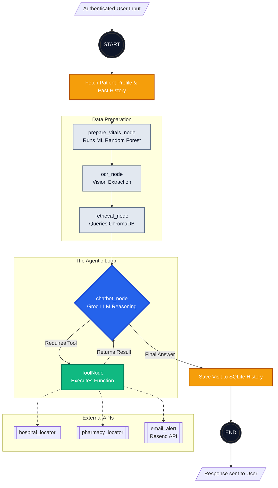

<div align="center">
  
# 🏥 ER Triage Intelligence & Agentic Assistant
  
**An AI-Powered Clinical Decision Support System built for Emergency Rooms.**

[](https://fastapi.tiangolo.com/)
[](https://python.org)
[](https://scikit-learn.org/)
[](https://sqlite.org/)

*A Final Year Project predicting triage priority levels (L0-L3) using vital signs, enriched with an autonomous LLM Agent (LangGraph) for contextual medical guidance and patient history tracking.*

</div>

---

## 🌟 Key Features

### 🧠 1. Machine Learning Triage Prediction
- Predicts emergency severity levels (**L0 Non-Urgent** to **L3 Emergent**).
- Analyzes 9 core patient features (Age, Heart Rate, SpO2, Pain Level, etc.).
- Powered by a robust **Random Forest Classifier** trained via Scikit-Learn pipelines.

### 🤖 2. Agentic LLM Workflow (LangGraph)
- Instead of a simple chatbot, the system operates as an **Autonomous Agent**.
- Evaluates the ML prediction, extracts text from uploaded prescriptions (Vision OCR), and queries a Vector Database for clinical guidelines (RAG).
- **Tool Calling**: Automatically decides when to use external tools like `hospital_locator` or `pharmacy_locator`.

### 🔐 3. Patient Authentication & Memory
- Secure, custom-built authentication system using **JWT** and **bcrypt** password hashing.
- **Persistent SQLite Database**: Stores user accounts, patient profiles (age, gender, chronic conditions).
- **Long-term Agent Memory**: The agent remembers past visit history and automatically references it in new conversations.

### 🚨 4. Automated Emergency Email Alerts
- If the AI or the ML model detects a "Level 2" or "Level 3" urgent triage risk, it autonomously drafts and sends an **Emergency Email** to the patient.
- Uses the **Resend API** to dynamically deliver personalized medical risks and addresses of nearby hospitals without prompting the user.

---

## 🏗️ System Architecture

The backbone of this project is built on **LangGraph**. The workflow acts as a state machine that seamlessly transitions between data preparation, retrieval, and LLM reasoning.


---

## 🚀 User Guide: How to Run the App

### Prerequisites
- Python 3.9+
- API Keys for **Groq** (LLM) and optionally Google/OpenAI (if used for Vision/Places). Set these in a `.env` file at the root.

### 1. Installation
Clone the repository and install the required dependencies:
```bash
git clone https://github.com/mahaveer0738/fyp-health-app.git
cd "fyp health-app/fyp app"
pip install -r requirements.txt
```

### 2. Start the Backend Server
Run the FastAPI application via Uvicorn. *(The SQLite database will automatically be generated on the first run).*
```bash
uvicorn backend.main:app --reload
```
The API will be available at: `http://localhost:8000`

### 3. Using the Web Interface
1. Open `frontend/templates/register.html` in your web browser.
2. **Create an Account**: Enter your details and any chronic conditions.
3. **Login**: Authenticate at `login.html`. Your JWT token will be saved securely in your browser.
4. **Dashboard**: Navigate the interface to input your vitals for ML prediction or chat with the autonomous clinical agent!

---

## 📂 Deep Dives & Documentation
Want to know how the internals work? We have detailed documentation in the `backend/` folder:
- 📖 [**Architecture Guide**](backend/ARCHITECTURE.md): An in-depth look at LangGraph, Nodes, Edges, and the ReAct Agent flow.
- 🔐 [**Auth & Security Deep Dive**](backend/AUTH_DEEPDIVE.md): Detailed explanation of JWT, bcrypt hashing, SQLite schema design, and how to protect against XSS/MITM attacks.

---

## 🔮 Future Implementations & Roadmap

While this project is fully functional, there are several exciting features planned for future iterations:

1. **Gmail / Google OAuth2 Single Sign-On (SSO)**
   - *Plan:* Allow users to bypass traditional email/password registration by clicking "Sign in with Google" (Gmail Login).
   - *Why:* Simplifies user onboarding and relies on enterprise-grade Google security for authentication.
   
2. **HTTPS & Secure Cookies**
   - *Plan:* Transition away from storing JWTs in `localStorage` and move to `HttpOnly` secure cookies to prevent XSS attacks in a production environment.
   
3. **Advanced RAG Integration**
   - *Plan:* Connect the ChromaDB to live, constantly updating medical journal APIs rather than static PDF uploads.
   
4. **Frontend Framework Migration**
   - *Plan:* Port the Vanilla HTML/JS frontend to **React** or **Next.js** for smoother state management, faster routing, and dynamic UI animations.

---
<div align="center">
  <i>Developed for a Final Year Project. Always consult a real medical professional for health emergencies.</i>
</div>
