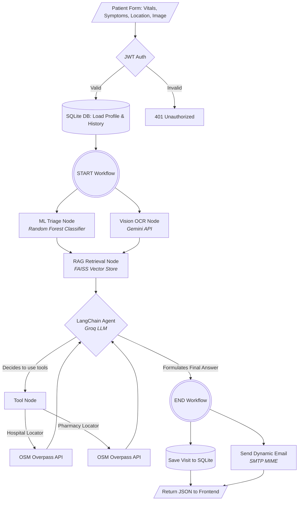

<div align="center">
  
# 🏥 NexaCare: AI-Powered ER Triage & Clinical Assistant
  
**An Autonomous Clinical Decision Support System and Patient Management Platform**

[](https://fastapi.tiangolo.com/)
[](https://python.org)
[](#)
[](https://scikit-learn.org/)
[](https://sqlite.org/)

*NexaCare is a comprehensive Final Year Project (FYP) that bridges the gap between machine learning triage, autonomous AI agents, and practical healthcare delivery. It predicts emergency severity levels, acts as a virtual conversational doctor, performs document OCR, locates nearby medical facilities, and automates patient follow-ups.*

</div>

---

## 🌟 Executive Summary

Emergency rooms are often overcrowded, leading to critical delays in patient care. **NexaCare** addresses this by providing an intelligent, multi-modal triage system. When a patient arrives (or uses the app remotely), their vital signs are immediately processed by a Machine Learning model to determine a priority level (L0 to L3). 

Instead of stopping at simple prediction, NexaCare hands the context over to an **Autonomous AI Agent** (powered by LangGraph and Groq). The agent converses with the patient, searches a local RAG medical database for treatment guidelines, reads uploaded medical documents via OCR, and actively executes tools to find nearby hospitals or pharmacies based on the user's GPS coordinates. Finally, it securely logs the visit in a local database and dispatches a dynamically color-coded summary email to the patient.

---

## 🏗️ Complete System Architecture

NexaCare's backend is a state-machine workflow orchestrated by **LangGraph**. This allows the AI to "think", execute tools, read memory, and iterate until a complete medical response is formed.


```mermaid
graph TD
    %% Entry Point
    Input[/Patient Form: Vitals, Symptoms, Location, Image/] --> AuthCheck{JWT Auth}
    
    %% Authentication & User Data
    AuthCheck -- Valid --> FetchProfile[(SQLite DB: Load Profile & History)]
    AuthCheck -- Invalid --> Reject[401 Unauthorized]
    
    FetchProfile --> START(((START Workflow)))

    %% Data Preparation Nodes
    START --> ML_Node[ML Triage Node<br/><i>Random Forest Classifier</i>]
    START --> OCR_Node[Vision OCR Node<br/><i>Gemini API</i>]
    
    ML_Node --> RAG_Node[RAG Retrieval Node<br/><i>FAISS Vector Store</i>]
    OCR_Node --> RAG_Node
    
    %% Core Agent Loop
    RAG_Node --> Chatbot_Node{LangChain Agent<br/><i>Groq LLM</i>}
    
    %% Tool Calling
    Chatbot_Node -- Decides to use tools --> Tool_Executor[Tool Node]
    Tool_Executor --> |Hospital Locator| HospitalAPI[OSM Overpass API]
    Tool_Executor --> |Pharmacy Locator| PharmacyAPI[OSM Overpass API]
    HospitalAPI --> Chatbot_Node
    PharmacyAPI --> Chatbot_Node
    
    %% Final Output
    Chatbot_Node -- Formulates Final Answer --> END(((END Workflow)))
    
    %% Post-Processing
    END --> SaveDB[(Save Visit to SQLite)]
    END --> EmailService[Send Dynamic Email<br/><i>SMTP MIME</i>]
    
    SaveDB --> Output[/Return JSON to Frontend/]
    EmailService --> Output
```

---

## 🚀 Core Features Deep Dive

### 🧠 1. Agentic AI & Persistent Memory (LangGraph)
- **Autonomous Reasoning:** Unlike standard chatbots, NexaCare operates as an agent. It analyzes the ML triage result, reads the patient's past visit history, and decides autonomously if it needs to call external location tools.
- **Persistent Memory:** Using LangGraph's `MemorySaver`, the agent remembers the context of the conversation. Patients can ask follow-up questions (e.g., *"I also have a headache, what should I do?"*) and the agent will respond dynamically without losing the initial triage context.
- **RAG (Retrieval-Augmented Generation):** A local FAISS vector database powered by HuggingFace embeddings (`all-MiniLM-L6-v2`) provides the LLM with grounded, factual medical guidelines, drastically reducing hallucinations.

### ⚕️ 2. Machine Learning Triage Prediction
- **Random Forest Classifier:** Trained on clinical datasets to analyze 9 core features including Age, Heart Rate, SpO2, Systolic Blood Pressure, Temperature, Pain Level, and Arrival Mode.
- **Severity Levels:**
  - `Level 0`: Non-Urgent (Green)
  - `Level 1`: Standard (Yellow)
  - `Level 2`: Urgent (Orange)
  - `Level 3`: Emergent/Critical (Red)

### 📍 3. Automated Facility Locators
- When a patient submits their GPS coordinates, the AI agent is equipped with two custom tools: `hospital_locator` and `pharmacy_locator`.
- The agent utilizes the OpenStreetMap Nominatim and Overpass APIs to find physical healthcare facilities within a dynamically expanding radius.
- The results are injected cleanly into the frontend UI side-panels.

### 📩 4. Dynamic Email Reporting
- Following the initial triage, the backend automatically dispatches an HTML email to the patient.
- **Dynamic Styling:** The email header features the NexaCare logo (embedded via CID inline attachments to bypass spam blockers) and a colored border that dynamically changes (Red, Orange, Green) based on the patient's ML triage severity.
- **AI Conciseness:** The agent generates a hyper-condensed 2-sentence summary specifically for the email, ensuring the patient gets immediate, digestible advice.

### 🖼️ 5. Vision AI (OCR)
- Patients can upload images of physical prescriptions, lab reports, or rashes.
- The system processes these via the Gemini Vision API, extracting clinical text and injecting it directly into the LangGraph state for the agent to analyze.

### 🔐 6. Security & Database
- **JWT Authentication:** Completely secure, stateless API authentication.
- **Bcrypt Hashing:** Passwords are mathematically hashed and salted.
- **SQLite + SQLAlchemy ORM:** A structured relational database handling `users`, `patient_profiles`, and complete `visit_history` tracking.

---

## 🛠️ Technology Stack

| Domain | Technologies Used |
| :--- | :--- |
| **Backend Framework** | FastAPI, Uvicorn |
| **AI / LLM Orchestration** | LangChain, LangGraph, Groq (Llama3) |
| **Machine Learning** | Scikit-Learn, Pandas, NumPy |
| **Vector Database (RAG)** | FAISS, HuggingFace (`all-MiniLM-L6-v2`) |
| **Database & ORM** | SQLite, SQLAlchemy |
| **Security** | PyJWT, Passlib, Bcrypt |
| **Frontend** | Vanilla HTML5, CSS3 (Glassmorphism UI), Vanilla JavaScript |

---

## 📁 Directory Structure

```text
fyp app/
├── backend/
│   ├── agent/               # LangGraph AI Workflow
│   │   ├── nodes/           # Graph Nodes (chatbot, retrieval, etc)
│   │   ├── tools/           # Hospital/Pharmacy locators, Emailer
│   │   ├── graph.py         # StateGraph definition & edge routing
│   │   └── state.py         # TypedDict Agent State definition
│   ├── api/                 # FastAPI Routes (auth, chat, predict)
│   ├── core/                # Config (env vars) & Security (JWT/Bcrypt)
│   ├── db/                  # SQLAlchemy Models, Database setup
│   ├── ml/                  # Random Forest models & pipelines
│   ├── rag/                 # FAISS Vector store & embeddings
│   └── main.py              # FastAPI application entry point
├── frontend/
│   ├── assets/              # Hero images, mockups
│   ├── Icons/               # NexaCare branding, logos
│   └── templates/           # HTML templates (index, login, dashboard, manual_entry)
├── requirements.txt         # Python dependencies
└── README.md                # Project documentation
```

---

## ⚙️ Setup & Installation

### 1. Clone the Repository
```bash
git clone https://github.com/mahaveer0738/fyp-health-app.git
cd "fyp-health-app/fyp app"
```

### 2. Set Up Virtual Environment
```bash
python -m venv venv
# On Windows:
venv\Scripts\activate
# On Mac/Linux:
source venv/bin/activate
```

### 3. Install Dependencies
```bash
pip install -r requirements.txt
```

### 4. Environment Variables
Create a `.env` file in the `backend/` directory with the following keys:
```env
# AI APIs
GROQ_API_KEY=your_groq_api_key
GEMINI_API_KEY=your_gemini_api_key

# Security
SECRET_KEY=generate_a_random_secure_string_here
ALGORITHM=HS256
ACCESS_TOKEN_EXPIRE_MINUTES=1440

# Email Automated System (App Passwords)
SENDER_EMAIL=your_email@gmail.com
GMAIL_APP_PASSWORD=your_google_app_password
```

### 5. Run the Application

**Start the FastAPI Backend:**
Open a terminal in the root `fyp app` folder and run:
```bash
python -m uvicorn backend.main:app --port 8000 --reload
```

**Serve the Frontend:**
Open a *second* terminal in the `frontend/` folder and run:
```bash
python -m http.server 3000
```
Then open your browser to `http://localhost:3000/templates/index.html`.

---

## 📡 Core API Endpoints

- **`POST /auth/register`**: Creates a new user and sets up their initial patient profile.
- **`POST /auth/login`**: Authenticates user and returns a JWT access token.
- **`GET /auth/profile`**: Retrieves the authenticated user's complete medical profile and visit history.
- **`POST /chat/`**: The core multi-part endpoint. Accepts Vitals (JSON), symptoms, GPS location, and optional image files. Triggers the entire LangGraph AI pipeline.

---

## 🔮 Future Enhancements (Phase 4)
- **Cloud Deployment:** Migration of SQLite to PostgreSQL (Neon) and hosting FastAPI on Render/Railway.
- **Live Vitals Integration:** Expanding the manual entry form to support automated imports from wearable IoT health devices.
- **Multi-Lingual Support:** Translating the AI responses and medical guidelines based on user locale preferences.

---
*Developed for Final Year Project (FYP) 2026. Prioritizing AI-driven healthcare accessibility.*
